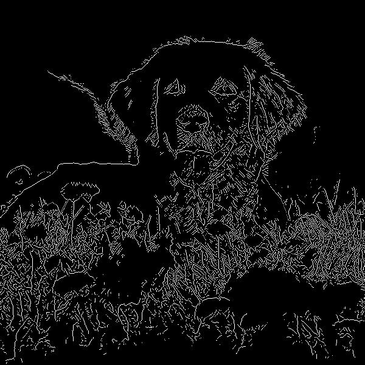

# Colourblind helper in Rust!

## Labels the colours in an image using image segmentation

### Helpful in particular to colourblind artists working from reference images

This project is still under development.  I have edge detection :D  I will be 
using this to generate a Voronoi diagram for seeding region growing.

